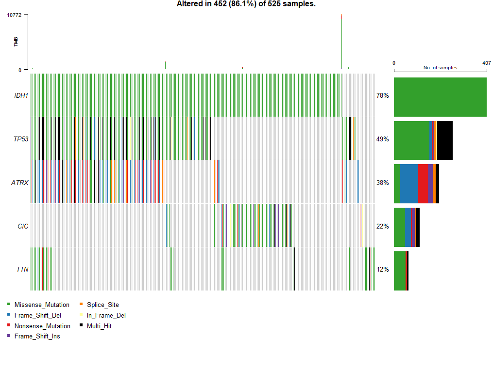
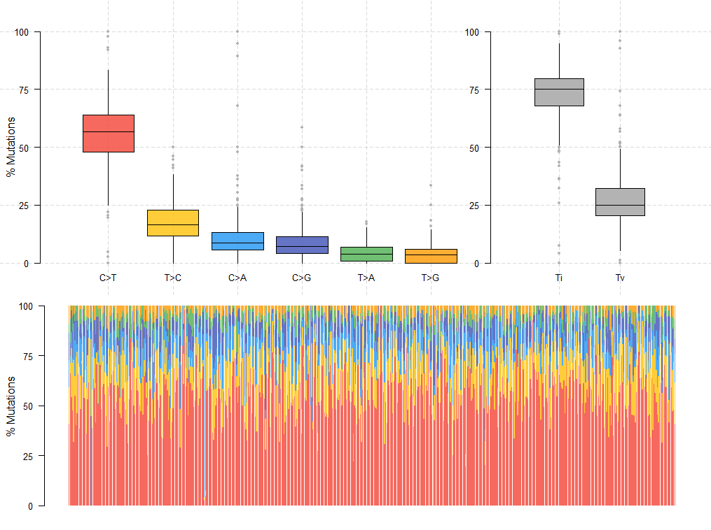
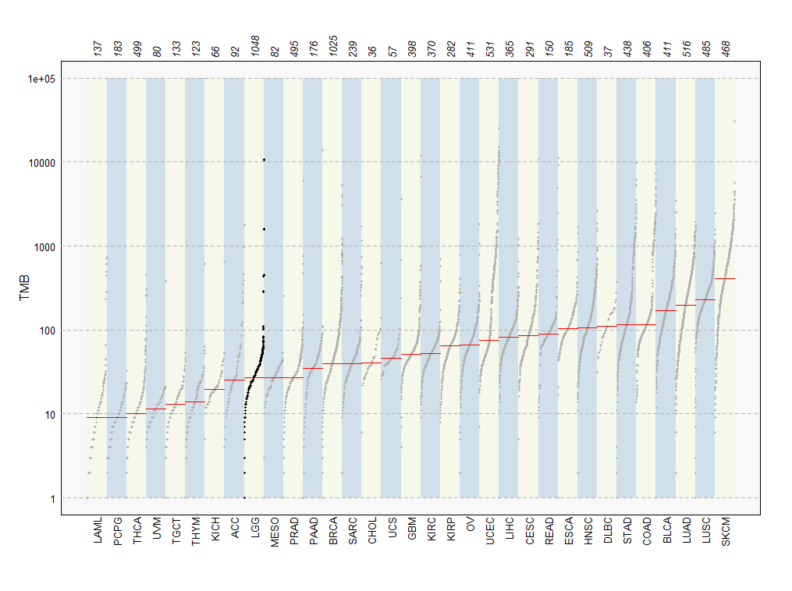

# Working with Genomic Variant Files task report - Hector Kroes

## 

**Q1: How many positions are found in this region in the VCF file?**

A: 
```
(vcf) krois@Ubuntu:~/Data/BRN/vcf$ tabix CEU.exon.2010_03.genotypes.vcf.gz 1:1105411-44137860 | wc -l
69
```
There are 69 positions in this region of the VCF file.

**Q2: How many samples are included in the VCF file?**

A:
```
(vcf) krois@Ubuntu:~/Data/BRN/vcf$ bcftools query -l CEU.exon.2010_03.genotypes.vcf.gz | wc -l
90
```
90 samples are included in the VCF file.

**Q3: How many positions are there total in the VCF file?**

A:
```
(vcf) krois@Ubuntu:~/Data/BRN/vcf$ bcftools query -f '%POS\n' CEU.exon.2010_03.genotypes.vcf.gz | wc -l
3489
```
In total there are 3489 positions in the VCF file.

**Q4: How many positions are there with AC=1? Note that you cannot simply count lines since the output of bcftools filter includes the VCF header lines. You will need to use bcftools query to get this number.**

A:
```
(vcf) krois@Ubuntu:~/Data/BRN/vcf$ bcftools query -f '%AC\n' CEU.exon.2010_03.genotypes.vcf.gz | grep ^1$ | wc -l
1075
```
There are 1075 positions with AC=1.

Comment:
```
(vcf) krois@Ubuntu:~/Data/BRN/vcf$ bcftools filter -i AC=1 CEU.exon.2010_03.genotypes.vcf.gz | grep -v ^# | wc -l
1075
```
The same result can be achieved using `bcftools filter` and grepping out the header by excluding lines starting with '#'.

**Q5: What is the ratio of transitions to transversions (ts/tv) in this file?**

A: 
```
(vcf) krois@Ubuntu:~/Data/BRN/vcf$ bcftools stats CEU.exon.2010_03.genotypes.vcf.gz
# This file was produced by bcftools stats (1.16+htslib-1.16) and can be plotted using plot-vcfstats.
# The command line was: bcftools stats  CEU.exon.2010_03.genotypes.vcf.gz
[...]
# TSTV  [2]id   [3]ts   [4]tv   [5]ts/tv    [6]ts (1st ALT) [7]tv (1st ALT) [8]ts/tv (1st ALT)
TSTV    0   2708    781 3.47    2708    781 3.47
[...]
```
The ts/tv ratio in this file 3.47

**Q6: What is the median number of variants per sample in this data set?**

A:
```
> lgg
An object of class  MAF 
                        ID summary   Mean Median
 1:             NCBI_Build      NA     NA     NA
 2:                 Center      NA     NA     NA
 3:                Samples     525     NA     NA
 4:                 nGenes   11767     NA     NA
 5:        Frame_Shift_Del     921  1.754      1
 6:        Frame_Shift_Ins     325  0.619      0
 7:           In_Frame_Del     372  0.709      0
 8:           In_Frame_Ins      14  0.027      0
 9:      Missense_Mutation   24953 47.530     23
10:      Nonsense_Mutation    1729  3.293      1
11:       Nonstop_Mutation      18  0.034      0
12:            Splice_Site     728  1.387      0
13: Translation_Start_Site      39  0.074      0
14:                  total   29099 55.427     28
```
The median number of variations per sample in this data set is 28.

## Maftools plots

**Plot 1: An oncoplot of the top five mutated genes**



**Plot 2: A boxplot of the transistion-to-transversion ratio**



**Plot 3: A plot comparing the mutation load in this LGG cohort to other TCGA cohorts. Use log scale.**

